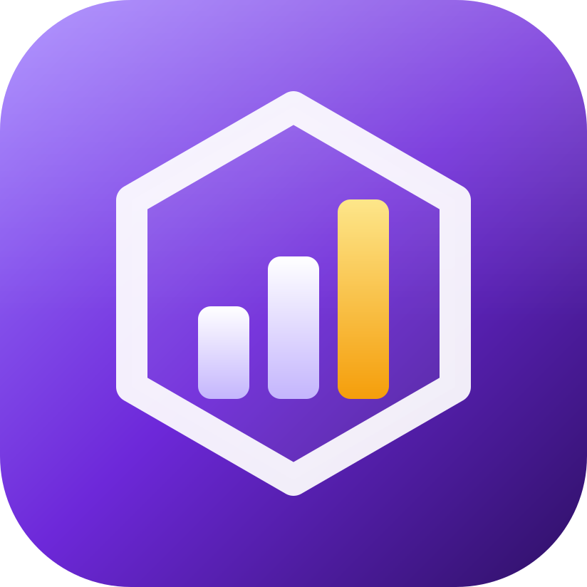
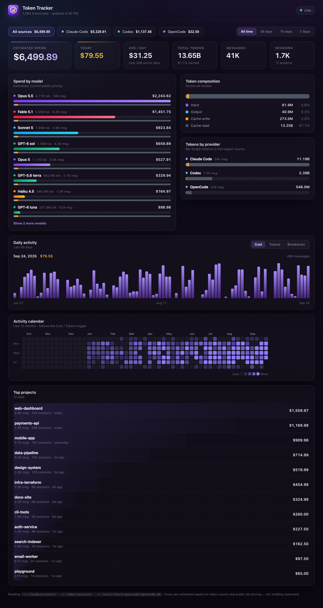
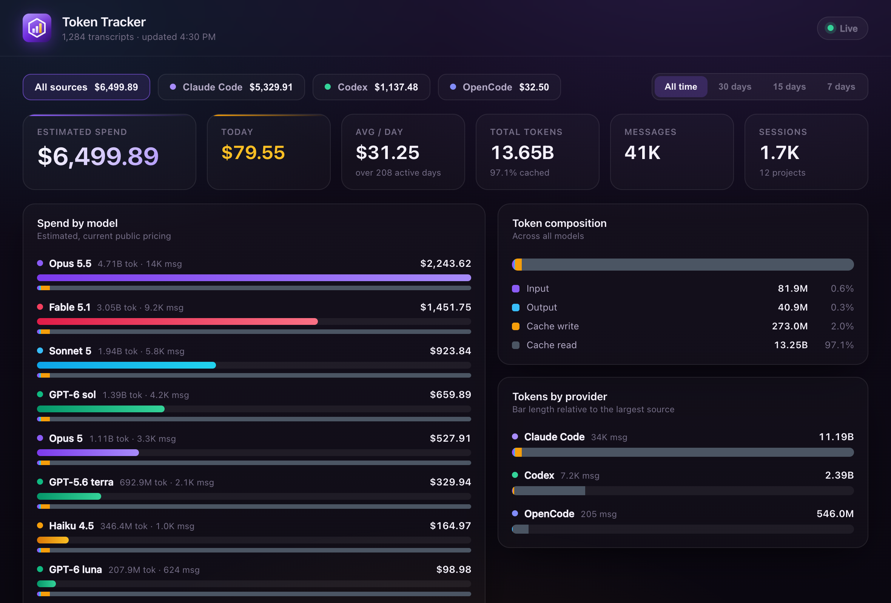
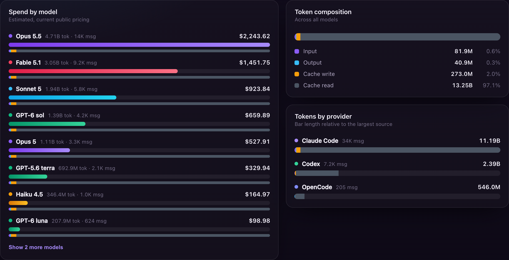
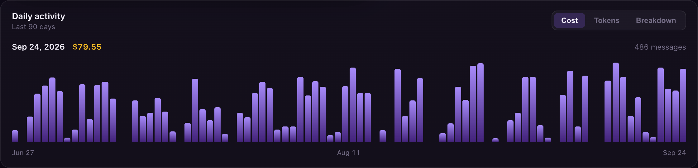
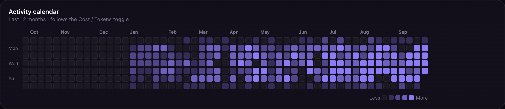

<p align="center">
  
</p>

# Token Tracker

[](https://github.com/edselserrano/token-tracker)
[](https://tauri.app)
[](https://react.dev)
[](https://www.typescriptlang.org)
[](https://www.rust-lang.org)
[](./LICENSE)
[](https://github.com/edselserrano/token-tracker)

Desktop app (Tauri v2 + React) that visualizes your local AI coding-assistant
usage — estimated spend, token breakdown, daily activity, and per-project cost —
read straight from your transcripts. A menu-bar tray shows today's estimated
cost at a glance.



<sub>Screenshots use generated demo data.</sub>

## Supported sources

Reads usage from three AI coding-assistant tools, side by side:

| Source | Location | Format |
| ------ | -------- | ------ |
| **Claude Code** | `~/.claude/projects/**/*.jsonl` | JSONL transcripts |
| **Codex CLI** | `~/.codex/sessions/**/rollout-*.jsonl` | JSONL rollout files |
| **OpenCode** | `~/.local/share/opencode/opencode.db` | SQLite session DB |

No network, no telemetry. Everything is parsed locally on disk.

## What it shows



- **Source filter** — All / Claude Code / Codex / OpenCode, each chip showing
  its spend.
- **Range** — All time / 30 / 15 / 7 days.
- **Estimated spend / today / avg per day / tokens / messages / sessions** —
  six headline stat cards; the tokens card shows how much was served from cache.
- **Spend by model** — horizontal bars per model (Opus 5.5, Fable 5.1, Sonnet 5,
  GPT-6 Sol, Haiku 4.5…) with inline token mini-bars showing input / output /
  cache-write / cache-read. Shows the top 8, with a toggle for the rest.
- **Token composition** and **Tokens by provider** — stacked bars comparing
  token types overall and per source.

  

- **Daily activity** — bar timeline (up to 90 days), toggle cost ⇄ tokens ⇄
  breakdown, hover for per-day detail.

  

- **Activity calendar** — GitHub-style contribution calendar for the last 12
  months: one column per week, one row per weekday, shaded in 5 levels by
  quartile of your active days. Hover a day for its cost or tokens.

  

- **Top projects** — cost, messages, sessions, last-used per project (top 12).
- **Live** — a filesystem watcher refreshes the dashboard in place as
  transcripts change.
- **Tray** — today's combined estimated cost in the macOS menu bar, updates live.

  

## Prerequisites

- macOS (app uses native menu-bar tray + `.dmg` bundle target)
- [Node.js](https://nodejs.org) 20+
- [pnpm](https://pnpm.io) (`npm install -g pnpm`)
- [Rust](https://rustup.rs) (stable)

## Install

```bash
git clone https://github.com/edselserrano/token-tracker.git
cd token-tracker
pnpm install
pnpm tauri build    # outputs .dmg / .app under src-tauri/target/release/bundle/
```

Open the `.dmg` and drag **Token Tracker** to Applications.

## Develop

```bash
pnpm install
pnpm tauri dev      # run the app (Vite on :1420 + Rust backend)
pnpm tauri build    # bundled .app / .dmg
pnpm build          # frontend-only typecheck + Vite build
```

Backend unit tests (runs against your real local transcript data, not
fixtures):

```bash
cd src-tauri && cargo test report_smoke -- --nocapture
cd src-tauri && cargo test codex_only_filter
cd src-tauri && cargo test day_range_filter
```

Environment overrides:

- `CLAUDE_CONFIG_DIR` — alternate Claude config root (still looks under
  `<CLAUDE_CONFIG_DIR>/projects`)
- `CODEX_HOME` — alternate Codex home (still looks under
  `<CODEX_HOME>/sessions`)
- `XDG_DATA_HOME` — alternate XDG root for OpenCode DB

## Architecture

Everything meaningful lives in two files:

### Backend — `src-tauri/src/lib.rs`

Pipeline: walk transcript dirs → parse JSONL/SQLite → dedup → price →
aggregate. Returns a single `UsageReport` JSON blob.

```
collect_entries()   # walk dirs, parse files in parallel (rayon)
    ├── parse_claude_file()      # one Entry per assistant message with usage block
    ├── parse_codex_file()        # stateful: tracks session/model, emits per token_count event
    └── parse_opencode_db()      # reads sessions from SQLite

dedup by Entry.dedup_key         # c:{requestId}:{messageId} | x:{path}#{idx} | o:{sessionId}

pricing()                        # (input, cache_write, cache_read, output) USD per 1M tokens
    ├── claude_pricing()         # version-aware: Opus 3/4.x/5/5.5, Fable & Mythos 5.x, Sonnet, Haiku
    └── openai_pricing()         # tiers + dated price cuts: GPT-6, GPT-5.6, 5.5 … 4o, o-series

build_report() → UsageReport     # aggregates by model / day / project over the filter window
```

`start_watching()` monitors transcript dirs via `notify` (debounced 800ms) and
signals the frontend on changes. Provider summary is always computed over ALL
entries (ignoring filters) so the UI chips show stable totals.

### Frontend — `src/App.tsx` (+ `types.ts`, `format.ts`, `App.css`)

```text
App
├── Header (brand + live indicator)
└── Dashboard
    ├── ProviderTabs / RangeTabs
    ├── Stats (spend, today, avg, tokens, messages, sessions)
    ├── Spend by model (ModelBars with token mini-bars)
    ├── Token composition + Tokens by provider (stacked bars)
    ├── Daily activity (Timeline with cost/tokens/breakdown toggle)
    ├── Activity calendar (week × weekday contribution grid)
    ├── Top projects
    └── Footer (data dirs + disclaimer)
```

No chart library — all visualizations are hand-rolled CSS bars, grids, and
stacked elements.

### TypeScript types — `src/types.ts`

Must mirror the Rust structs (`#[serde(rename_all = "camelCase")]`). Adding a
field in `lib.rs` → add the matching `camelCase` field here.

## Pricing

Estimates use public list pricing (USD per 1M tokens). Pricing functions in
`src-tauri/src/lib.rs`:

- `claude_pricing(model, date)` — version-aware (Opus 5.5 vs 5 / 4.5+ vs
  legacy Opus, Fable/Mythos 5.1 cache-read rate, Sonnet 5, Haiku 3 vs 4.5).
  Handles context-window tags such as `claude-opus-5-5[1m]`.
- `openai_pricing(model, date)` — tier-based (GPT-6 Astra/Sol/Luna, GPT-5.6
  Sol/Terra/Luna/Cyber, 5.5, 5.4, 5.3 Codex, 5.2, 5.1, Pro models, 4.1, 4o,
  o-series). Price cuts are dated, so older entries keep the rate in effect
  when they were logged.
- `opencode_pricing(model, date)` — extracts provider ID from
  `<providerID>/<model>` format and dispatches to the appropriate pricing
  function.

Unknown / `<synthetic>` models are counted for tokens but priced at $0. These
are **estimates**, not a billing statement.

To update pricing when rates change, edit the pricing functions in
`src-tauri/src/lib.rs`; tests validate the tables and catch regressions.

## Contributing

See [CONTRIBUTING.md](./CONTRIBUTING.md) for setup, architecture notes, and
how to find work. All contributions must preserve the zero-network, zero-telemetry
guarantee.

This project follows the [Contributor Covenant](./CODE_OF_CONDUCT.md) code of
conduct.

## License

[MIT](./LICENSE)
